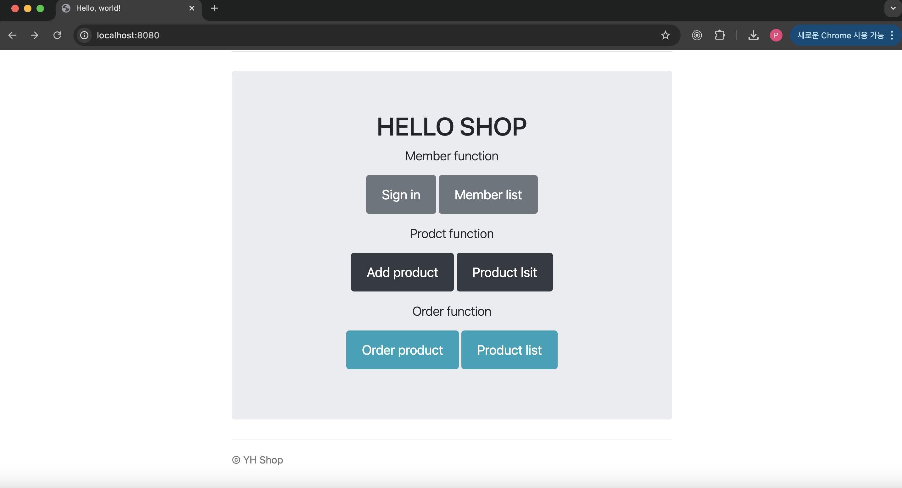
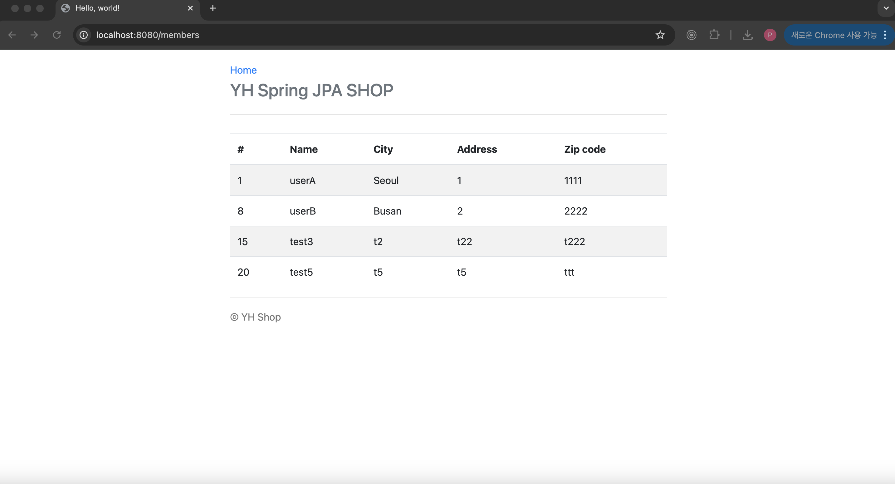
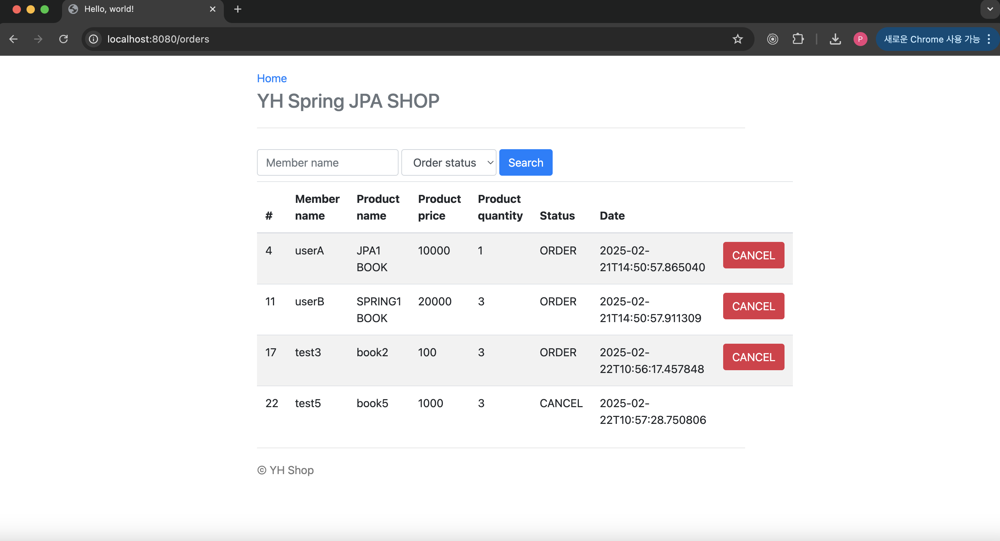
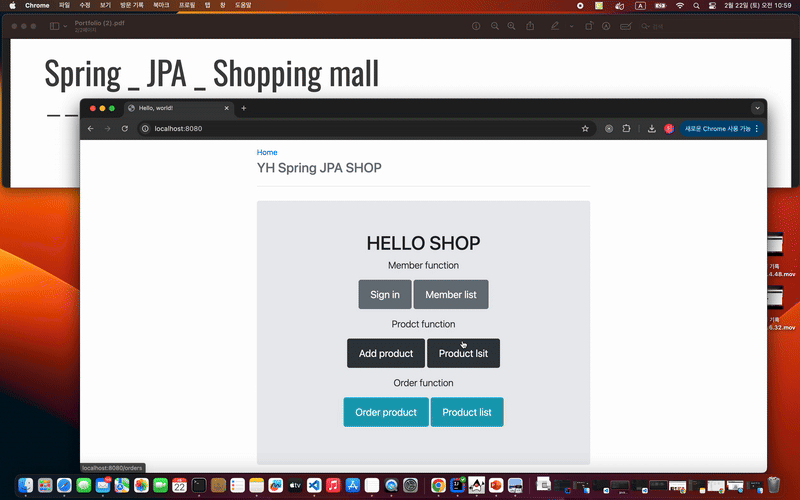

# Spring JPA Shopping Mall


<div style="display: flex; justify-content: space-around;">
  
  
  
</div>


---
---
<br>

# Feature


1. Member Management(Member function):<br>
<p>
Users can sign up for an account and manage their profile. Admins can view a list of registered members.
</p>
<br>
<br>

2. Product Management(Product function):<br> 
<p>
Admin users can add and update products. Each product includes a name, price, stock quantity, author and barcode for better organization.
</p>
<br>
<br>

3. Product Search & Filtering(Order function):<br>
<p>
Users can search for products by name and apply filters such as category or price range to find relevant items quickly.
</p>
<br>
<br>

4. Order Processing:<br>
<p>
Users can place orders, view order history, and check order statuses. The system automatically updates inventory upon successful checkout and it could cancel order.
</p>
<br>
<br>

5. REST API Support:<br>
<p>
Provides API endpoints for interacting with products, users, and orders, enabling future integration with external systems or a frontend application.
</p>
<br>
<br>


---
---
<br>

# Core technologies


- **Spring Boot** - Rapid development with embedded Tomcat  
- **Spring JPA (Hibernate)** - ORM-based database management  
- **Thymeleaf** - Server-side rendering for dynamic web pages  
- **H2 / MySQL Database** - Provides data storage options  
- **Lombok** - Reduces boilerplate code in Java  
- **Spring MVC** - Implements the Model-View-Controller pattern  


---
---
<br>

# Deployment

## 1. Installation

```bash
git clone https://github.com/sudoyh/SpringJPA_Shop.git

cd SpringJPA_Shop


```

<br>

## 2. Configure the Database

Modify the application.yml file to match your database settings:

```bash

spring.datasource.url : jdbc:h2:~/jpashop

spring.datasource.username=root

spring.datasource.password=your_password

```

## 3. Run the Application


run JpashopApplication.java


---
---
<br>

# Full video link 

Youtube : 


[📺 Youtube Link : https://youtu.be/RlwHAPbBsFk ](https://youtu.be/RlwHAPbBsFk)

---
---
<br>

# Demo




---
---